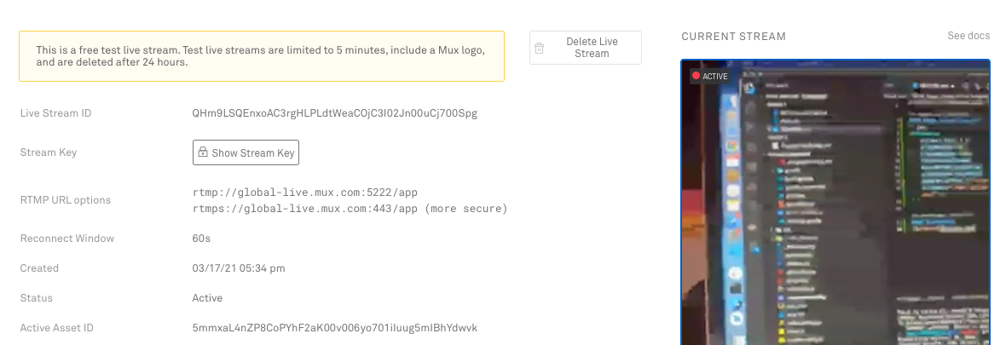

## React Native RTMP Bridging Android 🤖
This repo shows an example to bridge [RTMP library](https://github.com/pedroSG94/rtmp-rtsp-stream-client-java) in android. 

#### Usage inside `App.tsx`
```jsx
<CameraView
    style={{ flex: 1 }}
    streamWidth={720}
    streamHeight={1280}
    ref={cameraViewRef}
    audioMuted={audioMuted}
    videoMuted={videoMuted}
    camera={isFront ? "front" : "back"}
    streamUrl="rtmp://global-live.mux.com:5222/app/" />
```

#### Screenshot:
| Ingestion | Viewing |
| -- | -- |
|  | 