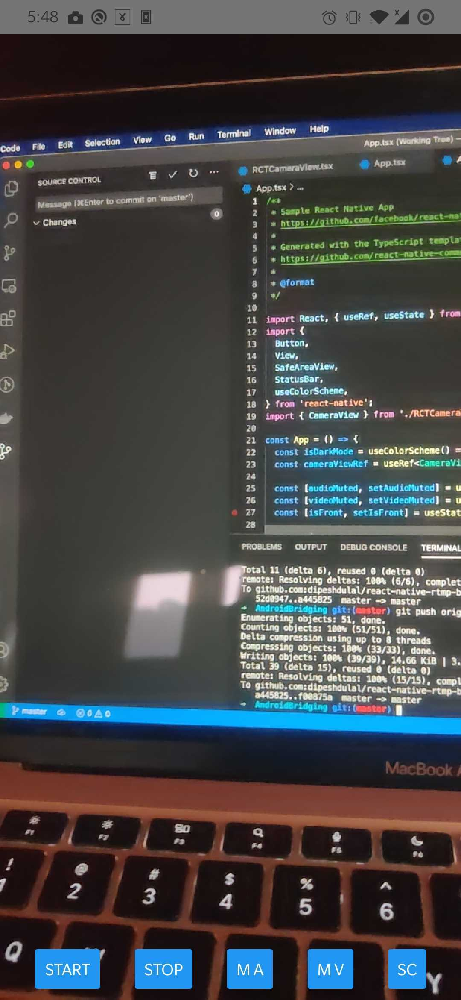

## React Native RTMP Bridging Android 🤖
This repo shows an example to bridge [RTMP library](https://github.com/pedroSG94/rtmp-rtsp-stream-client-java) in android. This has been created by following [this](https://akanza.pl/en/native-components-of-android-in-react-native) tutorial.


#### Usage inside `App.tsx`
```jsx
<CameraView
    style={{ flex: 1 }}
    streamWidth={720}
    streamHeight={1280}
    ref={cameraViewRef}
    audioMuted={audioMuted}
    videoMuted={videoMuted}
    camera={isFront ? "front" : "back"}
    streamUrl="rtmp://global-live.mux.com:5222/app/" />
```

#### Screenshot:
| Ingestion | Viewing |
| -- | -- |
|  |  |

#### Notes:
- Bridging requires `<Module>ViewManager` and `<Module>Package` files. View Manager is responsible for drawing and receiving different props from react native side and Package is responsible for adding multiple view managers. 

- `ViewManager` extends `SimpleViewManager<View>` class where as `Package` implements `ReactPackage` interface.
- Pacakge is then later added to `getPackages` method in `MainApplication.java`.
    ```java
    packages.add(new RCTCameraViewPackage())
    ```
- Custom RTMP classes such as; `CustomCamera2Base`, `CustomOpenGLView`,`CustomRTMPCamera2` has been added mostly to modify the `setAspectRatioMode` method so that aspect ratio mode can be changed. Original library only provides `xml` binding to change the property.

- Aspect Ratio modes are:
    ```xml
        <enum name="adjust" value="0"/>
        <enum name="fill" value="1"/>
        <enum name="adjust_rotate" value="2"/>
        <enum name="fill_rotate" value="3"/>
    ```
